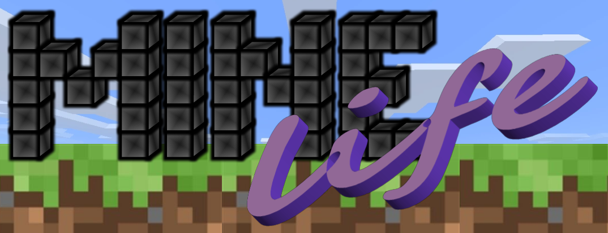

  

# minelife_modpack
Mods developed specifically for the Minetest server MineLife.

Note: The mods below cannot all be applied 1-to-1 to other servers, as they are interconnected and tailored to MineLife. Therefore, you should always adapt the code to your own needs before using it.

### Some components are in the ContendDB:
- [ColoredCement](https://content.minetest.net/packages/Truemmerer/colordcement/) - In Minelife Blocks
- [Invisible Blocks](https://content.minetest.net/packages/Truemmerer/invisible_blocks/) - In Minelife Blocks
- [ServerSay](https://content.minetest.net/packages/Truemmerer/serversay/) - In MineLife Servertools

## Components of this modpack

### MineLife Adminshop
MineLife Adminshop is a store system that allows users to trade with the server. 

Based on: [jeans_shopsystems](https://github.com/Jean28518/jeans_shopsystems) (Developed at the time for MineLife)

- depends = default, jeans_economy
- optional_depends = jeans_licenses

### MineLife UserShop
Lets players build their own stores and trade among themselves
Based on: [minetest_usershop](https://github.com/Jean28518/minetest_usershop) (Developed at the time for MineLife)

### MineLife Areas Pay
Gives users the opportunity to buy / sell or rent / lease land.

Based on: [areas_pay](https://github.com/Jean28518/areas_pay) (Developed at the time for MineLife)
- depends = default, dye, jeans_economy, areas, worldedit

### MineLife Beginnerguide
Some information for users who are new to the server. 
- depends = doc, jeans_licenses, minelife_server_tools

### MineLife Chatcolors
Zur Einfärbung der Teammitglieder und der Berufe. 
- depends = jeans_licenses

### MineLife Chest
Specially designed box for MineLife.
With this, users can easily assign the rights that other users can also access the box. In addition, this has upgrade options.

- depends = default
- optional_depends = areas, jeans_economy, pipeworks, xdecor

### MineLife Giftboxes
Boxes developed for Advent 2022 that open one door a day. Can easily be used for other purposes.
- depends: None

### MineLife Holograms
Create holograms with text in the air.
- depends = signs_lib
- author = lobnews

### MineLife Jobsystem
The system to perform jobs. Like Builder, Miner, Hunter, Farmer. 

Based on: [minetest_jobsystem](https://github.com/Jean28518/minetest_jobsystem) (Developed at the time for MineLife)
- depends = default, jeans_licenses,
- optional_depends = minelife_adminshop, jeans_economy

### MineLife Mapform
Gui for ingame maps.
- depends = sfinv_buttons

### MineLife Servertools
The core interface of MineLife. Autokick at afk, player statistics, admin commands and much more.  
- depends = default, jeans_licenses, serveressentials, hbhunger, minelife_jobsystem

### MineLife Spleefgame
A Spleefgame. Knock the other players into the dark and win. 
- depends = default

### MineLife Zones
Shows the players where they are in the screen border.

Based on: [minetest_buildingfarming_zone](https://github.com/Jean28518/minetest_buildingfarming_zone) (Developed at the time for MineLife)
- dependencies = default