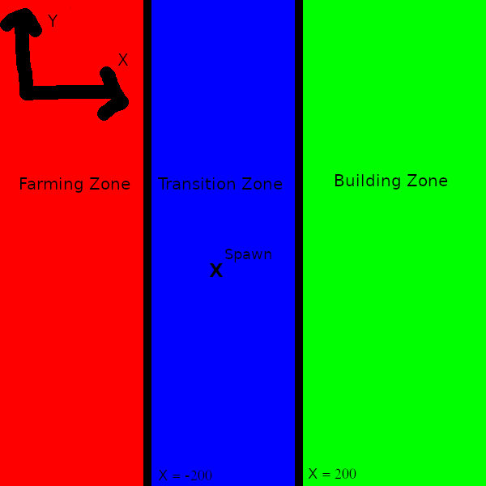

#  Mintest Mod: buildingfarming_zone

This Mod is made for servers.

## What does it do?
It decides in hand of an x **OR** y coordinate, in which from the three zones the player stands and shows it him the name of the zone with a specific color on the bottom right corner of the screen.

**This Mod doesnt protect anything, it just shows players, in wich zone they are!**

## Configuration:
You can configure the mod in the int.lua file. How to change something it is described in this file too.
